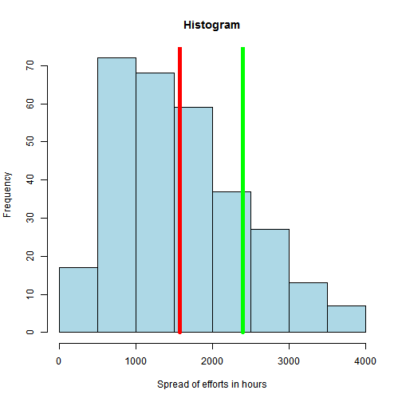

EstimationGuideline
========================================================
author: Daina Emmanuel
date: 21/06/2015

Pipeline of data product to develop - How to prioritize !
========================================================

We are all into developing data products , one important data needed for getting and sequencing all your ideas into a action is the effort need per project. 

This project aims at developing an estimation guideline for developing data products. 
It will help you 
- Prioritize better 
- Distribute and Delegate better 
- Most important achieve your plan

Parameters impacting the estimates
========================================================
The guideline is based on 4 parameters 

1. Complexity of the project 
2. Average expereince of the team 
3. Kind of project being done eg a live project or a proof of concept 
4. Scope of the project - be it data cleaning , data reporting , analysis etc

In the proof of concept I have randomized the values and weightage given to the estimates. It should ideally be driven based on historical data if available with the organization/individual or brain stormed to start with a reference estimates. 

Reference template for a Estimation guideline build on historical data
========================================================

```r
Complexity <- 1:5
Teamexperience <- 1:5
Account <- c("Development ProofOfConcept", "Development Live Project", "Enhancement")
dataPackage <- c("Data loading and Database","Data visualization","Analysis Reporting","Web interface")
dat <- data.frame(Complexity)
------
  -
  -
  -
  
finalDat <- data.frame(sampleDat, Value = runif(length(sampleDat[,1]), 50,200) ,Weight = runif(length(sampleDat[,1]), 5,20))
```


Plot to show historical trend Vs Estimated value for the project
========================================================

 

Next Steps and prospects
========================================================

1. This model can be extended , refined and used by any individual / organization by entering the values based on their trend. 

2. It helps engineers focus on their work with a easy to form plan 


